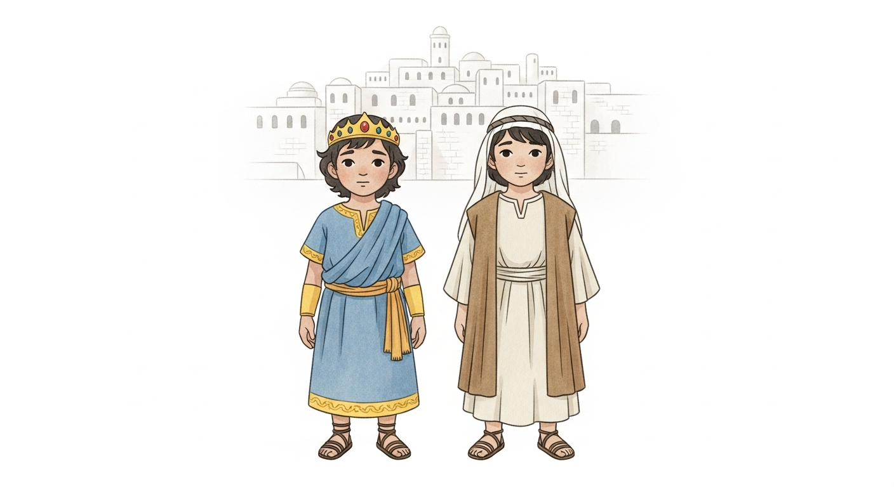
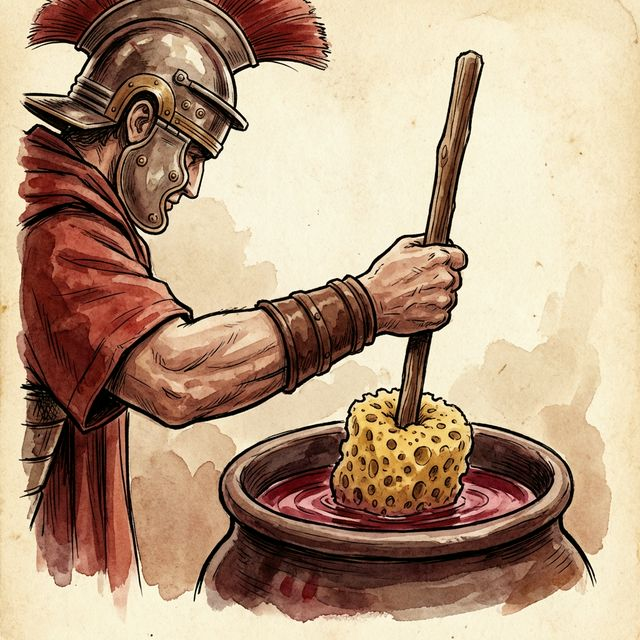
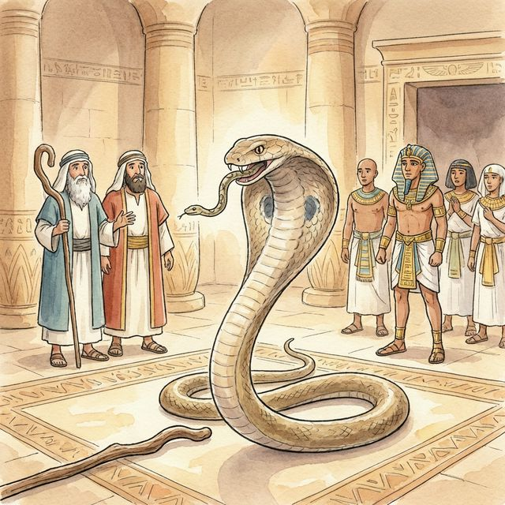

# Bible Riddles Quiz

A multilingual interactive quiz with 26 Bible riddles, illustrated questions, playful feedback, background music, and a downloadable reward gallery.

**[Play the live quiz](https://kiku-jw.github.io/bible-riddles-quiz/)**

[Features](#features) · [Run locally](#run-locally) · [Project structure](#project-structure)

## Features

- 26 Bible questions and riddles: 24 single-choice and 2 multiple-choice
- Ukrainian, Russian, and English interfaces
- Illustrated question cards and story transitions
- Per-answer feedback instead of generic correct/incorrect messages
- Sequential background-music playlist
- Progress tracking and animated completion screen
- Downloadable illustration gallery after completion
- Static GitHub Pages deployment with no backend or account system

## Screenshots

<div align="center">
  
  
</div>
<div align="center">
  
  
</div>

## Tech stack

- Next.js 16 and React 19
- TypeScript
- Tailwind CSS 4
- Framer Motion
- Static export for GitHub Pages

## Run locally

Prerequisites: Node.js 20.9 or later and npm.

```bash
git clone https://github.com/kiku-jw/bible-riddles-quiz.git
cd bible-riddles-quiz
npm ci
npm run dev
```

Open [http://localhost:3000](http://localhost:3000).

Create a production static export:

```bash
npm run build
```

## Project structure

- `lib/quiz-data.ts` — multilingual questions, answers, feedback, and illustration mappings
- `components/quiz/` — quiz flow, question cards, sound manager, and completion gallery
- `public/illustrations/` — question and reward artwork
- `public/audio/` — background-music playlist
- `app/` — Next.js entry points and public metadata

## Content note

The quiz is an independent educational project. Links shown after completion point to relevant public resources on JW.ORG.

## License

MIT. See [LICENSE](LICENSE).
